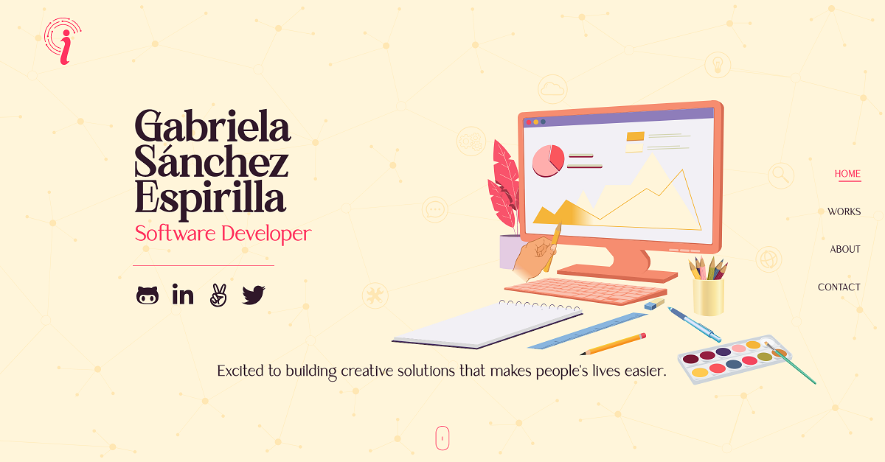
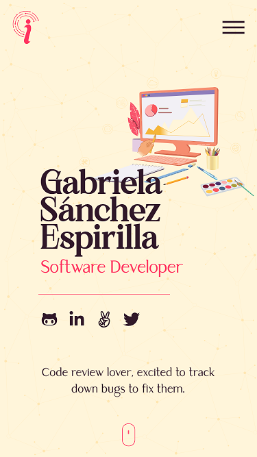
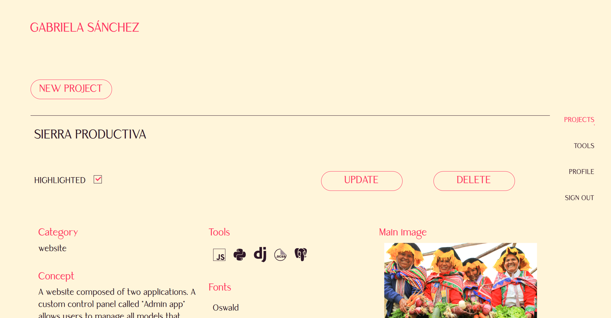
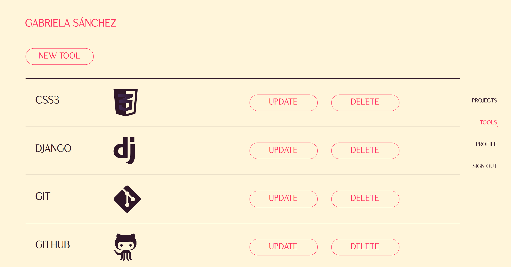

# my-portfolio
A fullscreen website composed of four sections to show the developer basic information, skills, and highlighted works.

## Features

- It is composed of a front-end and a back-end.
- The back-end allows user to manage the highlighted works which are displayed on the portfolio's main page dinamically. It uses a database service to persist users information with their corresponding access permitions, tools that save the logos corresponding to different programing languages and frameworks used to build the projects, and Projects which information will be displayed on the portfolio's works section.
- Regarding to the images, the database only save urls corresponding to the image's urls stored in the Amazon S3 cloud service.
- The portfolio admin user interface allows user to sign up a new account which require enter a valid email in orden to recieve the confirmation account, as well as the sign in interface.
- The portfolio admin also allows user to create, update and delete the users, tools and projects data, such changes will be reflected on the main page of the portfolio.
- The projects user interface allows users to highlight and unhighlit the projects they want to display on the main page of the portfolio.
- The front-end render four sections: Home, Works, About, and Contact.
- The front-end also have a menu which is displayed in a modal window on mobile devices, and in the right side of the screen on desktop devices.
- Users can use the scroll to navigate between sections, as well as the website's menu.

## Live demo

[www.gabyinnovasoftware.com](https://www.gabyinnovasoftware.com)

## Built With

- JavaScript
- React
- Redux
- NodeJS
- Express
- MongoDB
- Amazon S3

## Getting Started

To get a local copy up and running follow these simple example steps.

### Prerequisites

- Have `git` installed on your local computer.
- Have `node` installed on your local computer.

### Install

- Run the commant `git clone git@github.com:gabyse1/my-portfolio.git` or `git clone https://github.com/gabyse1/my-portfolio.git` to clone this repository to your local computer. Choose the location you prefer.
- Run the command `npm install` to install all the back-end project's dependencies.
- Run the command `cd client` to move tho the client folder.
- Run the command `npm install` to install all the front-end project's dependencies.

### Usage

- Run the command `npm run dev` to start the app's database.
- Run the command `cd client` to move tho the client folder.
- Run the command `npm run start` to start the portfolio website or open the url `http://localhost:3000` on a browser.

## Authors

👤 **Gabriela Sánchez Espirilla**

- GitHub: [@gabyse1](https://github.com/gabyse1)
- LinkedIn: [gabyse](https://www.linkedin.com/in/gabyse/)
- Twitter: [@gse_sd](https://twitter.com/gse_sd)

## 🤝 Contributing

Contributions, issues, and feature requests are welcome!

Feel free to check the [issues page](../../issues/).

## Show your support

Give a ⭐️ if you like this project!

## 📝 License

This project is [MIT](./LICENSE) licensed.
